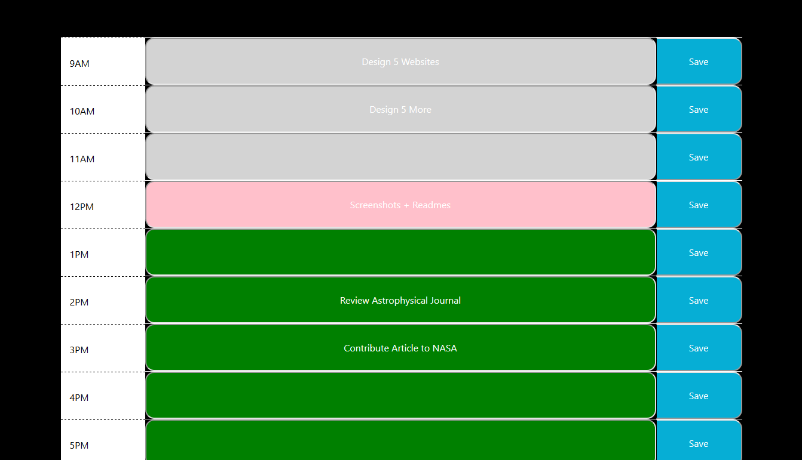

# dailyPlanner

## Deployed Site: https://94cooper94.github.io/dailyPlanner/.

Greetings! 

If you're looking for a new and improved method of tracking out your workdays, then look no further. As you can see with the brilliantly captured screenshots, this planner isn't your ordinary planner. This planner is color coordinated! Not only is it color coordinated, but it tracks and saves your inputs to the localstorage with a few simple clicks. Gone are the moments when you forget what hour of the day it is, simply because the hour wasn't color coordinated. Gone are the days where you'd lose precious data because it wasn't configured to save to your local storage. 

Make sure to mash that like & subscribe button so you don't miss out on future great deals.

