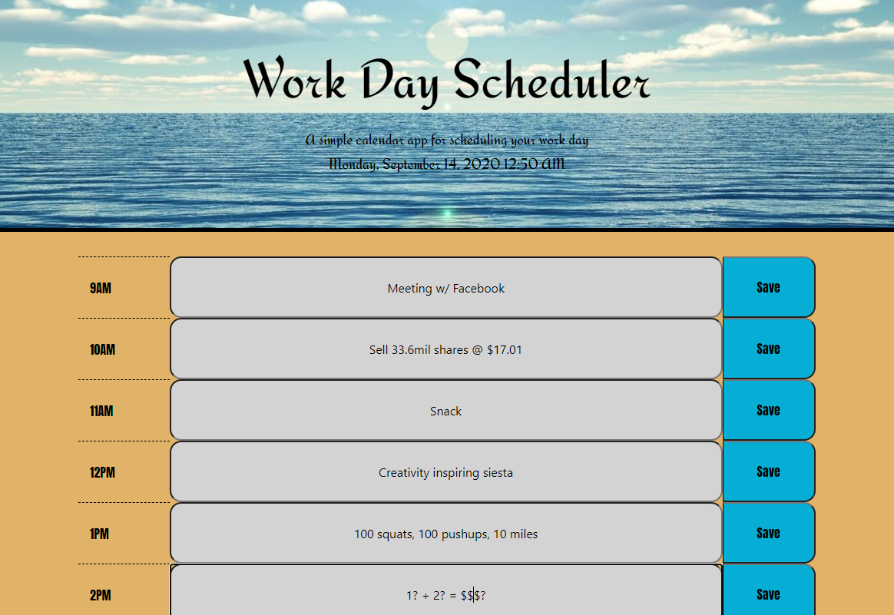
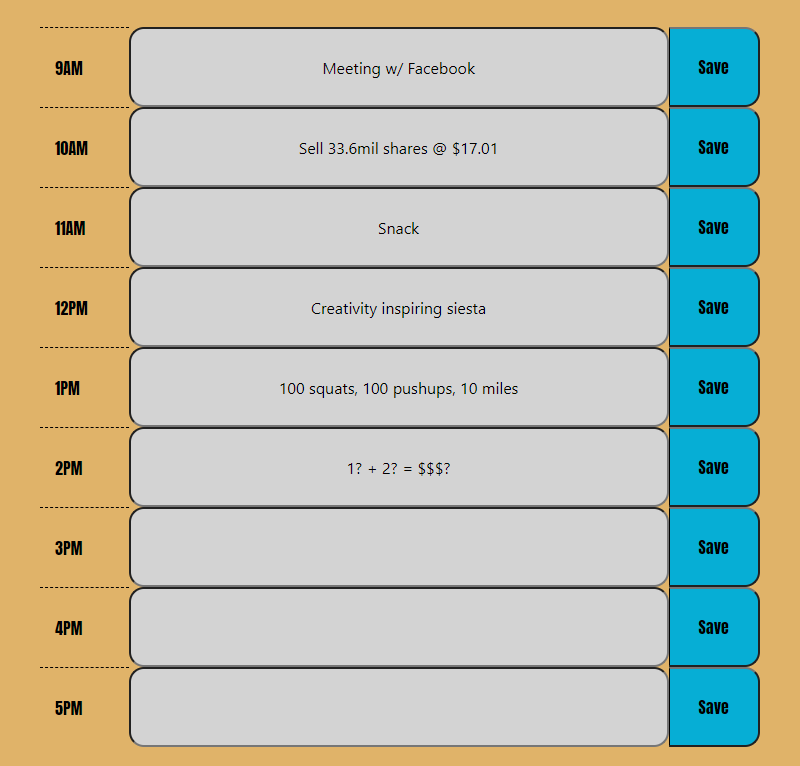
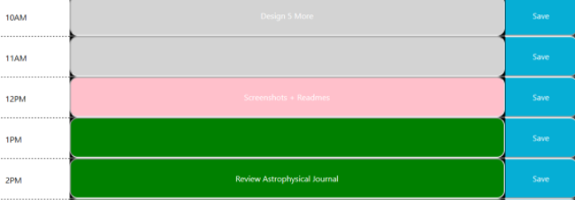
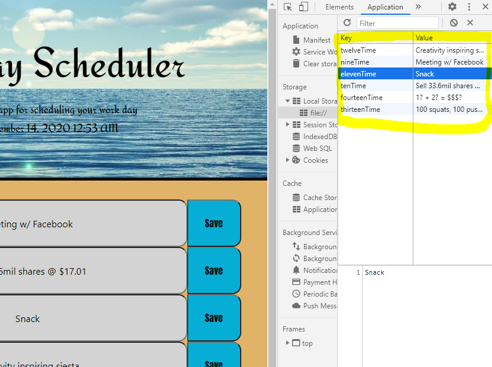
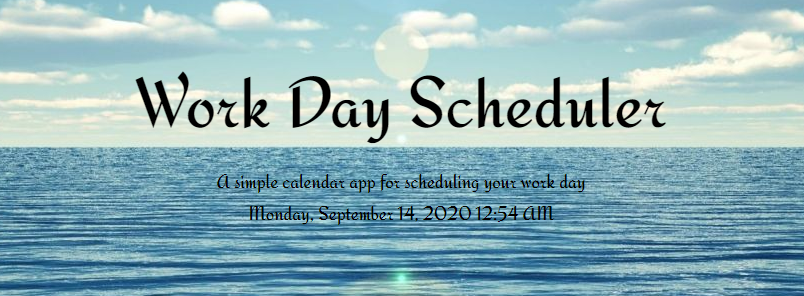

# dailyPlanner

## Deployed Site: https://94cooper94.github.io/dailyPlanner/.

Greetings! 

If you're looking for a new and improved method of tracking out your workdays, then look no further. This brilliantly styled daily planner will keep your eyes glued & your mind focused. Below you'll find a sample of the planner's input field:

Have you struggled with your work planners of the past because they lacked color coordination? Have your previous planners dropped-the-ball and erased crucial event information from existence? Fear no more, as this planner both colorizes the rows to distinguish what hour of the day it is AND it stores whatever information you input to your local storage!

Make sure to mash that like & subscribe button so you don't miss out on future projects. Here's an image that's sure to leave you feeling rejuventated.

